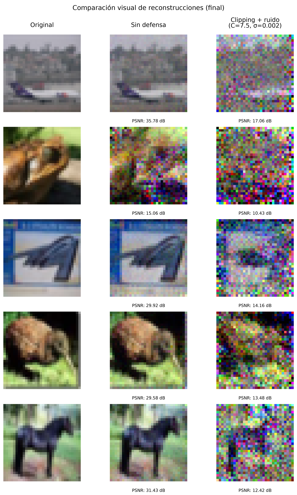
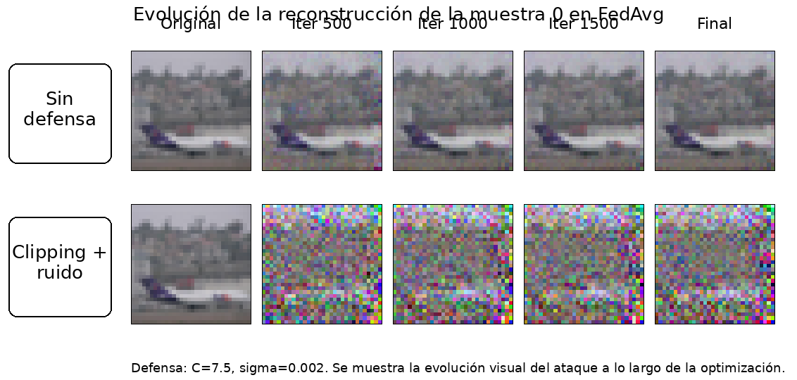
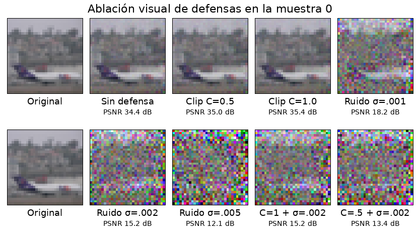

# Federated Learning Privacy Reconstruction and Inference

This repository contains the implementation, experiments, scripts, and result summaries developed for the Bachelor's Thesis:

**Evaluación de privacidad y seguridad en aprendizaje federado para clasificación de imágenes**

The project studies privacy leakage in federated learning for image classification, focusing on reconstruction attacks and label inference from gradients and local model updates.

## Overview
## Key visual result

A local model update can reveal highly recognizable information about a
client's training image. The reconstruction becomes substantially less
informative when clipping and Gaussian noise are applied.

<p align="center">
  <a href="./docs/images/reconstruction_comparison_samples0_4_final.png">
    
  </a>
</p>

<p align="center">
  <em>
    Click the figure to view it at full resolution. Columns compare the
    original image, reconstruction without defense, and reconstruction after
    applying empirical clipping and Gaussian-noise defenses.
  </em>
</p>

## Attack and defense progression

<p align="center">
  
</p>

The undefended update progressively reveals the original image, whereas the
defended signal remains visually uninformative under the evaluated setup.

## Defense ablation

<p align="center">
  
</p>

Federated learning reduces the need to centralize training data, but the gradients and model updates exchanged during training may still leak information about client data. This repository evaluates that risk experimentally using CIFAR-10, PyTorch, Flower, and a ResNet-18 adapted to CIFAR-10.

The main experimental baseline is based on FedAvg. FedSGD is included as a methodological contrast to study a different federated update dynamic, not as a direct accuracy competition against FedAvg.

## Main components

The repository includes:

- Federated training with Flower and PyTorch.
- CIFAR-10 image classification with an adapted ResNet-18.
- FedAvg baseline experiments.
- FedSGD contrast experiments.
- Gradient inversion and local update inversion attacks.
- Label inference experiments.
- MSE vs cosine matching comparisons.
- Batch size and local-step sensitivity experiments.
- Empirical defenses based on clipping and Gaussian noise.
- Defense ablation studies.
- Seed robustness experiments.
- CSV summaries, figures, and research notes used to support the thesis.

## Repository structure

```text
attacks/                  Reconstruction and inference attack scripts
fl_security_benchmark/    Federated learning application code
scripts/                  Experiment execution scripts
results/                  Generated outputs, figures, metrics, and summaries
research/notes/           Experiment notes and methodological tracking
configs/                  Configuration files, when applicable
